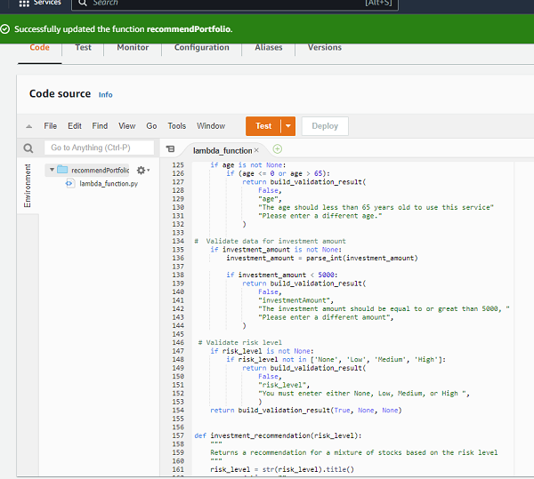
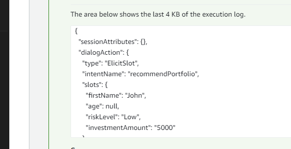
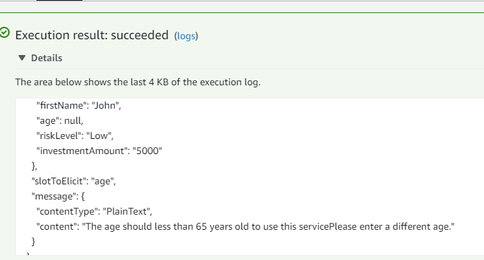
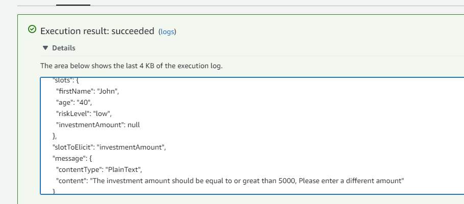
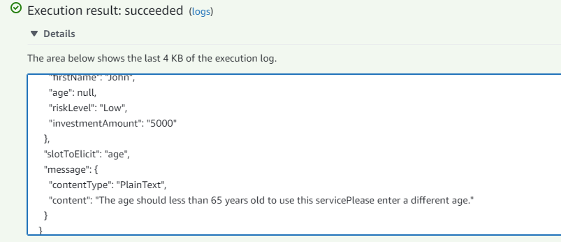
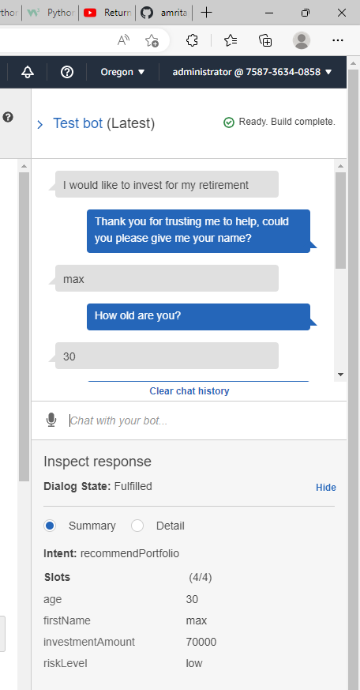

# RoboAdvisor_investment_portfolio

This repository is to create conversational Bot using Amazon lex and Lambda functions to enable client to make investment decisions.

----

## Technologies

Language: Python 3.9.12

Amazon Lex

Amazon Lambda

----

## Usage

User will interact with bot by text to make investment decisions.

----

## Steps Taken

1. Configure the initial robo advisor: Defining an Amazon Lex bot with a single intent 
that establishes a conversation about requirements to suggest an investment portfolio for retirement.

2. Build and test the robo advisor: Make sure that your bot works and accurately responds during the conversation with the user.

Test Corrent dialog 

Test age

Test investment amount

Test negative Error

3. Enhance the robo advisor with an Amazon Lambda function: Create an Amazon Lambda function that validates the user's input and returns the investment portfolio recommendation. This includes testing the Amazon Lambda function and integrating it with the bot.

---

## Contributors

Brought to you by Amrita Prithiani

## License

MIT